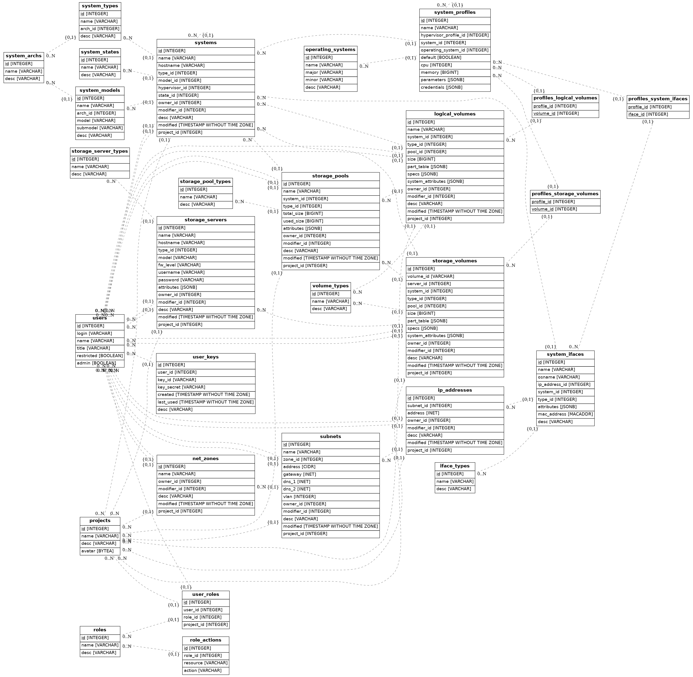

<!--
Copyright 2016, 2017 IBM Corp.

Licensed under the Apache License, Version 2.0 (the "License");
you may not use this file except in compliance with the License.
You may obtain a copy of the License at

   http://www.apache.org/licenses/LICENSE-2.0

Unless required by applicable law or agreed to in writing, software
distributed under the License is distributed on an "AS IS" BASIS,
WITHOUT WARRANTIES OR CONDITIONS OF ANY KIND, either express or implied.
See the License for the specific language governing permissions and
limitations under the License.
-->
# Database

## Considerations

For database handling we use sqlachemy's ORM (Object Relational Mapper) and [alembic](http://alembic.zzzcomputing.com/en/latest/tutorial.html) to manage the migrations.

The declarative base and all the models are located in the file `db/models.py`. Any modifications to the database layout are done in this file.

Below it is possible to see a visual representation of the database models. Some differences may exist between the chart and the actual models therefore you should always refer to the models file for accurate information.



Even though we use sqlalchemy to abstract database access and in theory could use different backends, we are currently relying on specific postgres types (like INET and JSONB) so only postgres is supported by the application.

## How to get a dev environment

First of all, you need a database ready to go and it's a good idea to also use a virtualenv. Here's how you can accomplish this:

```bash
# install postgres server
dnf install postgresql-server

# initialize db and start service
postgresql-setup --initdb

# allow user to connect
sed -i '1 s,\(^.*$\),local\tall\tengine\tmd5\n\1,' /var/lib/pgsql/data/pg_hba.conf

# start/restart the service
systemctl restart postgresql

# create a user, a database and appropriate permissions
runuser -u postgres createuser engine
runuser -u postgres createdb -E UTF8 --lc-collate=en_US.utf8 --lc-ctype=en_US.utf8 engine
runuser -u postgres -- psql engine -c 'ALTER DATABASE engine OWNER TO engine'
runuser -u postgres -- psql engine -c "ALTER ROLE engine WITH PASSWORD 'pass4engine';"

# create the virtualenv
tox -e devenv

# switch to your virtualenv
cd .tox/devenv && source bin/activate

# set the path to the engine conf file
export TESSIA_CFG=etc/tessia/engine.yaml

# edit the engine config file to point to your development database
sed -i 's,^  url:.*$,  url: postgresql://engine:pass4engine@/engine,g' $TESSIA_CFG

# it's a good idea to enable echo too to see everything sa and alembic are doing
sed -i 's,^  debug:.*$,  debug: True,g' $TESSIA_CFG

# make sure your database is clean
tessia-dbmanage reset

# initialize the database (this will also create the basic types needed by the application)
tessia-dbmanage init-db

# if you want to populate your database with some random data you can follow the steps below
# first, generate some random entries with the helper script:
../../tools/db/gen_random_data.py > /tmp/data.json

# then feed the database with the generated file:
tessia-dbmanage feed-db /tmp/data.json
```

## How to make changes to the database schema

Once you have a dev environment ready to go (see previous section), follow these steps:

- Update the `db/models.py` file accordingly
- Create a new revision in alembic to have the database migration versioned. All database handling should be done through the command `tessia-dbmanage`.
  Assuming you have a shell with the virtualenv active, type for example `tessia-dbmanage create '0.0.2 (add new table foo)'`.
  Alembic creates a new revision and a migration script (python file) under `db/alembic/versions` for you.
- Alembic is configured to autogenerate the changes in the migration script, but it's not 100% safe. Check the file to make sure the correct changes are being applied.
  You might also want to see the resulting sql for verification, this can be accomplished by using the -s option of the upgrade option as in `tessia-dbmanage upgrade -s +1`.
  Only the sql is generated but no actual changes are applied to the database so you can run it as many times as you want.
  In case something is wrong in the script you can edit it and generate the sql again. If the error was in the models file you can delete the migration file and repeat the previous step.
- Apply the changes to the database with `tessia-dbmanage upgrade +1`
- If everything looks good, commit the new migration script and the changes in the models file.
- Get yourself a coffee while you wait for your colleagues to review your patch ;)
