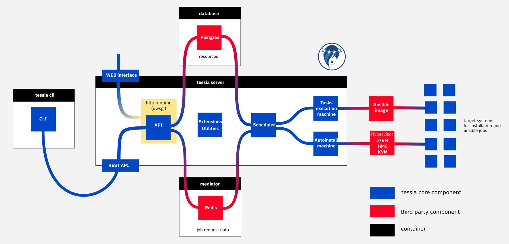
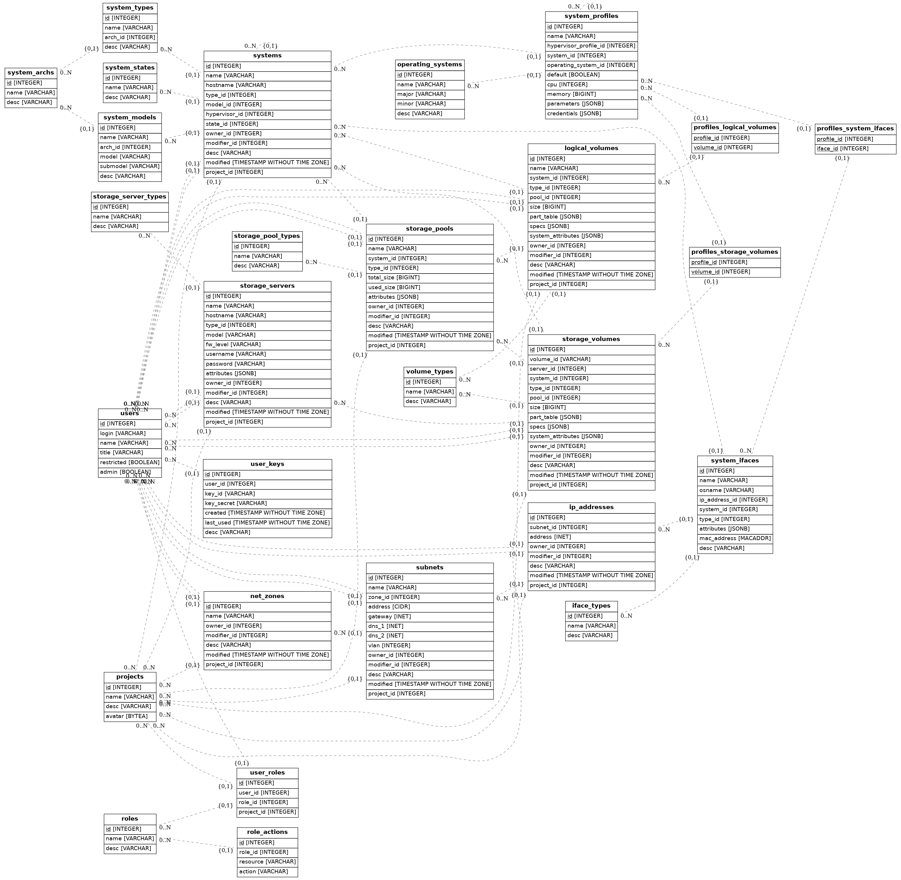

<!--
Copyright 2017 IBM Corp.

Licensed under the Apache License, Version 2.0 (the "License");
you may not use this file except in compliance with the License.
You may obtain a copy of the License at

   http://www.apache.org/licenses/LICENSE-2.0

Unless required by applicable law or agreed to in writing, software
distributed under the License is distributed on an "AS IS" BASIS,
WITHOUT WARRANTIES OR CONDITIONS OF ANY KIND, either express or implied.
See the License for the specific language governing permissions and
limitations under the License.
-->
# Design topics

This page provides information about design decisions and inner workings of the tool.

## Architecture

Below is a diagram showing the different components and how they interact with each other:

Link to source: [architecture.odp](architecture.odp)

In a nutshell, the process of starting a new installation consists of:

- user executes a command in client/click a button in Web UI
- client/UI submits HTTP request (POST) to the REST-API
- REST-API adds a new job request in db's requests table
- Scheduler periodically queries the db and collects the new entry in requests table
- Scheduler spawns the corresponding State machine as a new process (fork)
- State machine does its job
- once finished, the State machine's process dies
- the scheduler periodically detects died processes and sets their job states to finished in the jobs db table

## Database

For database handling we use sqlachemy's ORM (Object Relational Mapper) and [alembic](http://alembic.zzzcomputing.com/en/latest/tutorial.html) to manage the migrations.

The declarative base and all the models are located in the file `db/models.py`. Any modifications to the database layout are done in this file.

Below it is possible to see a visual representation of the database models. Some differences may exist between the chart and the actual models therefore you should always refer to the models file for accurate information.

Even though we use sqlalchemy to abstract database access and in theory could use different backends, we are currently relying on specific postgres types (like INET and JSONB) so only postgres is supported by the application.

### How to make changes to the database schema

Once you have a dev environment ready to go (see [How to get a dev environment](dev_env.md)), follow these steps:

- Update the `db/models.py` file accordingly
- Create a new revision in alembic to have the database migration versioned. All database handling should be done through the command `tess-dbmanage`.
  Assuming you have a shell with the virtualenv active, type for example `tess-dbmanage rev-create '0.0.2 (add new table foo)'`.
  Alembic creates a new revision and a migration script (python file) under `db/alembic/versions` for you.
- Alembic is configured to autogenerate the changes in the migration script, but it's not 100% safe. Check the file to make sure the correct changes are being applied.
  You might also want to see the resulting sql for verification, this can be accomplished by using the -s option of the upgrade option as in `tess-dbmanage upgrade -s +1`.
  Only the sql is generated but no actual changes are applied to the database so you can run it as many times as you want.
  In case something is wrong in the script you can edit it and generate the sql again. If the error was in the models file you can delete the migration file and repeat the previous step.
- Apply the changes to the database with `tess-dbmanage upgrade +1`
- If everything looks good, commit the new migration script and the changes in the models file.
- Get yourself a coffee while you wait for your colleagues to review your patch ;)

## Authentication subsystem

The tessia client authenticates the user with the API server by using an authentication token which is generated on first usage.
The use of tokens is a secure method for user authentication because it does not store the password locally, instead relying on a pair (token and secret) of long
generated hashes (UUID) which are transmitted to the server on each request. This method has some advantages:

* In case of a compromise of the token (compromise of server database or the token file on local users' computer), an attacker would only be able
to access the tool itself and cannot use it to access other systems (as opposed to storing the password). The token can then be revoked and a new one
generated.
* It's possible to generate multiple tokens for the same user, each for a different purpose. Say, a token for use with the command line client
and another one for the user's custom tooling that communicates directly with the API server. That makes accounting more precise and allow the possibility
to fine control permissions for each token based on their different purposes.
