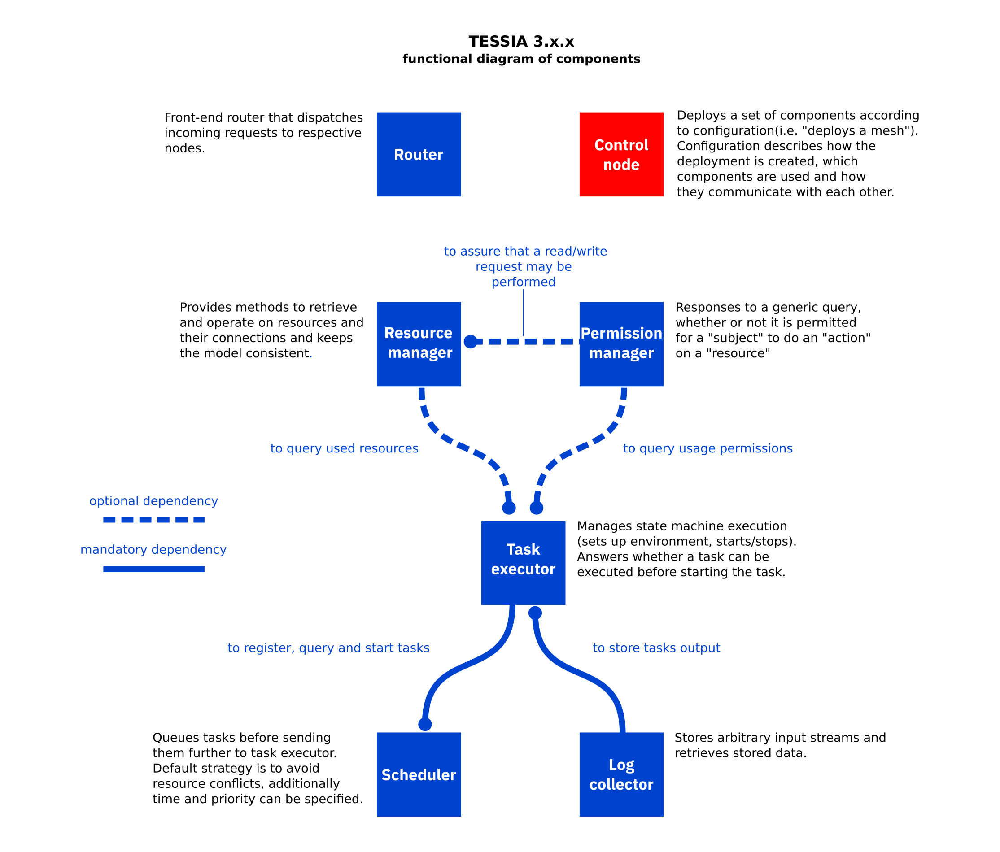

<!--
Copyright 2021 IBM Corp.

Licensed under the Apache License, Version 2.0 (the "License");
you may not use this file except in compliance with the License.
You may obtain a copy of the License at

   http://www.apache.org/licenses/LICENSE-2.0

Unless required by applicable law or agreed to in writing, software
distributed under the License is distributed on an "AS IS" BASIS,
WITHOUT WARRANTIES OR CONDITIONS OF ANY KIND, either express or implied.
See the License for the specific language governing permissions and
limitations under the License.
-->
# tessia-control-node

Last update: v0.0.2

This component manages tessia mesh instance. It can be used to start a new mesh
instance or as an agent to run additional instances.

## General functional diagram of tessia mesh components



## Structure

As is common with tessia mesh, components have an API module (Flask application)
and a library module. Control-node also provides a command-line interface to
interactively deploy an instance.

```
├ api             REST API module
├ conf            Configuration examples
├ control_node    Library module
├ doc             Documentation
└ tests           Tests
__init__.py       Package initialization
__main__.py       Command-line interface
```

## Configuration

Control-node configuration specifies the mode of operation for the node and may
also contain configuration for other components. For example:
```
{
    "mode": "detached",
    "components": {
        "control_node": {
            "listen": "localhost",
            "port": 7350,
            "api_app": "control_node.api:create_app()",
            "configuration": {}
        },
        "permission_manager": {
            "listen": "localhost",
            "port": 7351,
            "api_app": "permission_manager.api:create_app()",
            "configuration": {}
        },
        "resource_manager": {
            "listen": "localhost",
            "port": 7352,
            "api_app": "resource_manager.src.application.api.flask_app:create_app()",
            "configuration": {}
        },
        "scheduler": {
            "listen": "localhost",
            "port": 7354,
            "api_app": "scheduler.api:create_app()",
            "configuration": {
                "scheduler": {
                    "permission-manager": {
                        "url": "https://localhost:7351"
                    },
                    "resource-manager": {
                        "url": "https://localhost:7352"
                    }
                }
            }
        }
    }
}
```
`components` is a dictionary with mesh components to be started. When an
instance is started with the configuration above, it deploys permission manager,
resource manager, scheduler (with indication to use permission and resource
managers) **and a new control node** that can start additional instances.

`mode` defines mode of operation:
- `detached`: components start as Flask processes at indicated `listen` and
  `port`.

A working example configuration is provided in `conf/default.json`.

### Detached mode

Each component has an API entry point (Flask application), indicated by `api_app`
in configuration. Deployment in detached mode starts each component as a separate
[uWSGI](https://uwsgi-docs.readthedocs.io/en/latest/index.html) server 
with `listen` and `port` parameters.

Control node also creates a self-signed CA authority to issue server and client 
certificates for each component. This enables communication over TLS,
at the same time limiting connections only to parties with a client certificate
signed by same CA.

In case an extra client certificate is needed (e.g. to run queries in the mesh
during development), it can be created when starting control node 
from command line with `--make-cli-cert` flag.

## Usage

### Command-line interface

Start a tessia mesh instance:
```
python3 -m control_node --config control_node/conf/default.json
```

Start a tessia mesh instance and create additional client certificate:
```
python3 -m control_node --config control_node/conf/default.json --make-cli-cert
```

### Flask application

Start control node server with flask:
```
FLASK_APP=control_node.api flask run --port 7350
```

Start control node server with uwsgi:
```
uwsgi --http 'localhost:7350' --mount '/=control_node.api:create_app()'
```

**Note: TLS is not enabled for control node in these cases. However, each mesh started by the control node will have TLS connectivity between the components**

Refer to [API documentation](./api.md) for API usage.

### Library

Start instances via instance factory:
```python
from control_node.factory import InstanceFactory

with InstanceFactory.create_instance(configuration) as instance:
   instance.setup()
   instance.run()
   ...
```

`configuration` is a dictionary with configuration as above

